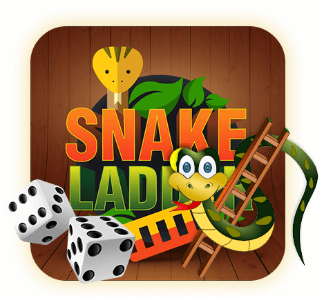

# 🎲 Vizion 2.0 – Snakes & Ladders Game (Classic & Twist Mode)

Welcome to **Vizion 2.0**, a modern multiplayer Snakes & Ladders game built with **React** and **Tailwind CSS**. Play the traditional game or explore the exciting **Twist Mode** that adds strategy and unpredictability!



## 🚀 Features

- 🎮 **Classic Mode**: Traditional Snakes & Ladders experience.
- 🌀 **Twist Mode**: Adds power-ups, traps, and random twists using a spin wheel.
- 👥 2 Player support with real-time stats.
- 🎲 Dice roll animations.
- 📊 Game log and statistics panel.
- 🧠 Strategic gameplay with new twist mechanics.

---

## 🔀 Game Modes

### 🔹 Classic Mode
> Pure Snakes & Ladders. Roll the dice and reach tile 100 before your opponent.

### 🔸 Twist Mode
> Introduces strategic twists triggered by a spin wheel or random events:

#### Twist Abilities:
- 🟥 **Push Attack**: Land on opponent’s tile to push them back 3 tiles.
- 🎲 **Double Dice**: Roll two dice but risk auto-snaking if a 1 appears.
- 👻 **Ghost Mode**: Immune to snakes for 3 turns.
- 🔁 **Reverse Ladder**: One ladder is secretly a trap that pulls you down!
- 💣 **Trap Tile**: Hidden explosive tiles pull you back.
- 🎁 **Mystery Powerup**: Get random perks or penalties.

---

## 🧩 Technologies Used

- ⚛️ React
- 🎨 Tailwind CSS
- 📦 Vite
- (Currently working) 🎯 Socket.IO – For multiplayer (coming soon!)

---

## 🖥️ Installation

```bash
# Clone the repo
git clone https://github.com/your-username/vizion-snake-ladder.git
cd vizion-snake-ladder

# Install dependencies
npm install

# Start the dev server
npm run dev


📁 Project Structure
bash
Copy
Edit
src/
│
├── components/         # Reusable components (Board, Dice, TwistManager, etc.)
├── Homepage.jsx        # Home landing page
├── Gamepage.jsx        # Game logic and rendering
├── SpinTheWheel.jsx    # Spin wheel for twist mode
├── Startgame.jsx       # Mode selection screen
├── assets/             # Images and styles
└── App.jsx             # App routes and structure


🧠 Future Enhancements :

Multiplayer support via Socket.IO
AI bot for single-player mode
User authentication and game history
Sound effects and animations

🙌 Made with ❤️ by Team Vizion
